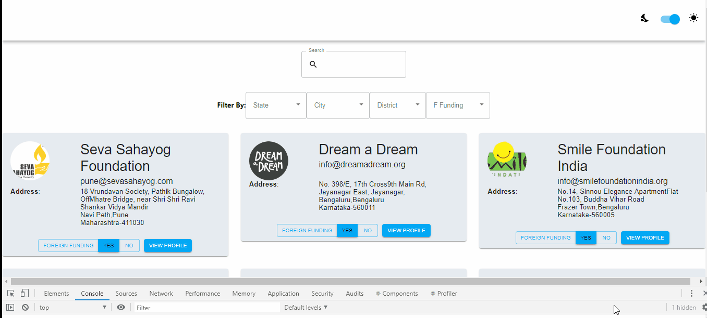

# Twitter Fetching Tweets

A MERN stack application built to filter ,sort NGO and also to claim the NGO



## Table of Contents

- [Ngo Claim](#ngo-claim)
  - [Table of Contents](#table-of-contents)
  - [Introduction](#introduction)
    - [Problem Statement](#problem-statement)
    - [Overview of the solution](#overview-of-the-solution)
    - [Challenges](#challenges)
  - [Important Folders and Files](#important-folders-and-files)
  - [Dependencies](#dependencies)
  - [Installation](#installation)
  - [Limitations](#Limitations)
  - [Author](#author)

## Introduction

**Tech Stack Used** : <br/>
**Front End**:React,Redux,Formik,Material UI <br/>
**Back End**:Express,Mongoose,Validator(npm package to interact with twitter api) <br/>

### Problem Statement

**Objective** Design and develop a Full Stack NGO details view and claim page<br/>

**Functional Requirements:**

**BACKEND:**<br/>

1. Create an NGO object with 7 fields- Logo (image url), Name (text), Registration date (date), Can receive foreign funding (boolean), E-mail ID for correspondence (Email format), Address (Line 1, Line 2, City, District, State, Pincode), Claimed/Unclaimed (boolean)<br/>
2. Feed 5 dummy NGOs into the DB (all with complete information set)<br/>

**FRONTEND:**<br/>

3. Create a search section, to search for NGOs by Name, Filter them by "Can receive foreign funding", "State", "District", "City". (Make this responsive)<br/>
4. Populate the filtered set (based on the search criteria) (Make this responsive)<br/>
5. If the NGO is unclaimed, show a "CLAIM" button against it. If the NGO is claimed, show a button which reads "VIEW PROFILE" against it.<br/>
6. Upon clicking on the "CLAIM" button, take me to a form like this: https://www.letsendorse.com/ngoForm (Replicate the fields) and pre-populate all the 7 fields which already existed. (Make all fields mandatory)<br/>
7. Upon filling the form and submitting, change the Claimed/Unclaimed status to Claimed.<br/>

### Overview of the solution

1. Building the backend for storing the data and CRUD operations for the NGO datas<br/>

2.Building front end with React,Redux for state management and formik <br/>

### Challenges

- Validating all the users information<br/>
- Filtering Information based on diffrent criteria <br/>
  -Design a good view for the used to interact with <br/>

reference : https://javascriptstore.com/2018/03/18/stream-tweets-with-react-express-socket-io-and-twitter/<br/>

- Making the view to be like twitter and Generate markup for a Tweet or Follow button
  Generate markup for an embedded Tweet or timeline
  Create an Embedded Search Timeline <br/>

## Important Folders and Files

```
twitter-tweets
 ┣ node_modules
 ┣ client
 ┣ app
 ┃  ┣ controllers
 ┃        ┗ ngoController.js     (How to handle backend when user searched for it)
 ┃  ┣ middleware
 ┃  ┗ models
 ┃         ┗ ngo.js             (model of the file)
 ┃
 ┣ config
 ┃      ┣ database.js           (Connects to the mongoDB database with the required config)
 ┃      ┗ routes.js             (Containes all backend points)
 ┃
 ┃
 ┣ .gitignore
 ┣ package.json                     (Contains all the packages and dependencies)
 ┣ README.md                        ( A Brief Description of the project)
 ┗ index.js                        (A Main backend file having all backend functions)

 client
 ┃
 ┣  public
 ┃    ┗ index.html            (contains header , ico icon )
 ┃
 ┗	src
     ┣actions
     ┃     ┗ ngo.js           (contains what the user searches for)
     ┣reducer
     ┃     ┗ ngoReducer.js      (Redux reducer containing what action to perform)
     ┣store
     ┃     ┗ configStore.js     (A Redux Store)
     ┣components
           ┣ card
           ┃ ┣ ngoCard.js     (Card for displaying data of NGO)
           ┃ ┣ ngoDetails.js  (Ngo details page)
           ┃ ┗ styles.js      (styles of the card)
           ┃
           ┣ form
           ┃ ┗ editForm.js     (Form for editing the details)
           ┣ navBar
           ┃ ┣ navBar.js        (Navigation bar)
           ┃ ┣ styles.js
           ┃ ┗ ThemeToggler.js  (Theme toggler to toogle between day and night themes)
           ┗ theme
              ┃ ┣ index.js
              ┃ ┣ palette.js
              ┃ ┣ theme.js
              ┃ ┣ ThemeContext.js
              ┃ ┣ ThemeProvider.js
                ┗ typography.js
    ┣ App.css
    ┣ App.js             (Main app file that contains the main js file)
    ┣ index.css
    ┗ index.js           (The index app containg store)
    ┣ package.json                     (Contains all the packages and dependencies)
    ┣ README.md


```

## Dependencies

concurrently >=3.6.0
express >= 4.16.3,
loadash: "^1.0.0",
mongoose: "^5.9.10",
validator: "^13.0.0",
@date-io/moment: ^1.3.13,
@material-ui/core: ^4.9.11,
@material-ui/icons: ^4.9.1,
@material-ui/lab: ^4.0.0-alpha.50,
@material-ui/pickers: ^3.2.10,
@testing-library/jest-dom: ^4.2.4,
@testing-library/react: ^9.5.0,
@testing-library/user-event: ^7.2.1,
axios: ^0.19.2,
formik: ^2.1.4,
formik-material-ui: ^2.0.0-beta.1,
formik-material-ui-pickers: 0.0.8,
loadash: ^1.0.0,
moment: ^2.24.0,
react: ^16.13.1,
react-dom: ^16.13.1,
react-redux: ^7.2.0,
react-router-dom: ^5.1.2,
react-scripts: 3.4.1,
redux: ^4.0.5,
redux-thunk: ^2.3.0,
styled-components: ^5.1.0,
sweetalert2: ^9.10.12,

## Installation

Install latest version of Node JS and Google Chrome<br/>

to run in local repository you can run <br/>

#### git clone https://github.com/Gauthamjm007/ngo.git

#### cd ngo

#### npm install

#### cd client

#### npm install

#### cd ..

#### npm run dev

## Author

- [Goutham JM](https://gauthamjm007.github.io/portfolio/)
